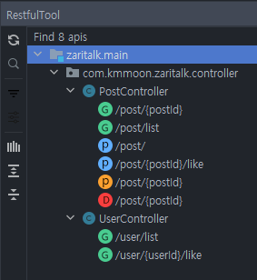

#과제

### 기능 요구사항
임대인간 소통이 필요하니 커뮤니티

* 가입되어있는 공인중개사, 임대인, 임차인, 외부 사용자 모두 쓸 수 있도록 해야 합니다.
* 임대인, 임차인, 공인중개사는 커뮤니티에 글을 쓸 수 있고, 외부 사용자는 글을 쓸 수 없습니다.
* 글 목록과 댓글 목록화면에는 작성한 사용자가 어떤 계정 타입인지를 표시할 수 있어야
   합니다. ex ) 김씨(공인중개사). 계정 타입은 한글로 표시되어야 합니다.
* 커뮤니티에 가입한 사용자라면 글 목록화면에 자신이 좋아요한 글인지 아닌지를 표시해
   줄 수 있어야 합니다. 
* 글 목록화면에는 글에 달린 좋아요 수를 표시할 수 있어야 합니다

### 기술 요구사항
요구기능은 다음과 같습니다. URL은 지원자님이 생각하시기에 가장 적당한 네이밍을
사용해주세요.
* 글 작성, 수정, 삭제
* 글 좋아요
* 글 목록

들어온 사용자가 임대인인지, 임차인인지, 공인중개사인지는 HTTP Header 중
Authorization 의 Value Prefix 에 따라 사용해 구분 할 수 있어야 합니다. 만약
Authorization 값이 없다면 외부 사용자로 취급합니다.

* Realtor 47 : 47번 공인 중개사 사용자 ex ) curl -H "Authorization: Realtor 47"
* Lessor 21 : 21번 임대인 사용자 ex ) curl -H "Authorization: Lessor 21"
* Lessee 562 : 562번 임차인 사용자 ex ) ex ) curl -H "Authorization: Lessee 562"

임대인, 임차인, 공인중개사인 경우 커뮤니티에 별도의 회원 테이블을 만들어 사용합니다.

* id : auto_increment 방식으로 사용하시면 됩니다.
* nickname : 닉네임
* account_type : 계정 타입 ( LESSOR : 임대인, REALTOR : 공인 중개사, LESSEE : 임차인 )
* account_id : 계정 ID로써 Authentication 값입니다. 필요하신 경우 임의로 채워주세요.
* quit : 탈퇴 여부

글에 좋아요 는 한 계정이 한 글에 한 번만 할 수 있습니다.
어떤 사용자가 어떤 글에 좋아요 했는지 히스토리를 확인할 수 있어야 합니다.

각 글은 작성시간, 마지막 수정시간, 삭제시간의 대한 히스토리를 확인할 수 있어야 합
니다.

### 사전 설정

* SpringBoot 2.6.4
* JDK 1.8

h2 database를 사용한다는 점 이외에 따로 설정이 필요 없습니다.
테이블은 JPA 설정으로 자동 생성되며, 기본 데이터는 data.sql로 등록합니다.
JPA와 Spring Security를 사용해서 인증 로직을 구현했습니다. 

### 사용 설명
기본 데이터로 등록된 Authorization header는 다음과 같습니다. 
* "Lessee 1"
* "Lessor 2"
* "Realtor 3"
* "Realtor 4"

GET Method는 비회원도 사용 가능하도록 만들었으며, 
POST, PUT, DELETE Method는 본인이 등록한 글인 경우 사용 가능합니다.

#### API List

| URI                               | method | Authorization | request body                                               | 설명                                           |
| --------------------------------- | ------ | ------------- | ---------------------------------------------------------- | ---------------------------------------------- |
| localhost:8080/user/list          | GET    | X             |                                                            | 유저 리스트 조회 커서기반 페이지네이션.   |
| localhost:8080/user/{userId}/like | GET    | X             |                                                            | 해당 유저의 좋아요 게시글 리스트 조회          |
| localhost:8080/post/list          | GET    | X             |                                                            | 게시글 리스트 조회 커서기반 페이지네이션. |
| localhost:8080/post/{postId}      | GET    | X             |                                                            | 해당 게시글 조회                               |
| localhost:8080/post/{postId}      | PUT    | 필수(본인만)  | {     "title": String,     "content": String } | 해당 게시글 수정                               |
| localhost:8080/post/{postId}      | DELETE | 필수(본인만)  |                                                            | 해당 게시글 삭제                               |
| localhost:8080/post               | POST   | 필수(본인만)  | {     "title": String,     "content": String } | 게시글 생성                                    |
| localhost:8080/post/{userId}/like | POST   | 필수(본인만)  |                                                            | 해당 게시글에 좋아요                           |

